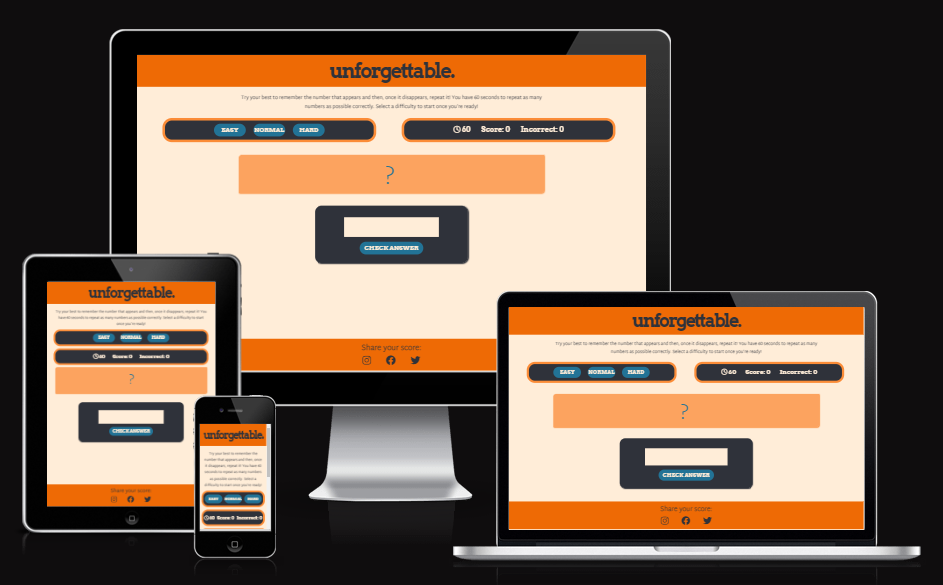

# Unforgettable
Unforgettable is intended to be a small yet enjoyable and addictive browser-based game that tests the user's memory with rapid intensity. The game should be easy to pick up for new users and quick and simple to play for both new and returning users. The site should be intuitive to navigate, pleasing on the eye, and not distract from the main game loop.

## Contents
- [UX](#ux)  
- [Design](#design)  
- [Features](#features)  
- [Technologies Used](#technologies-used)  
- [Deployment](#deployment)  
- [Testing](#testing)  
- [Credits](#credits)  

## UX
### User Stories:  

## Design
### Colour Scheme and Imagery:

### Typography:

## Features

### Future Implementations:

## Technologies Used

- This website was created with the HTML5, CSS3, and JavaScript programming languages.  
- This website was developed within [Gitpod](https://www.gitpod.io/).  
- The repository for this website was created using [GitHub](https://github.com/) and [Git](https://git-scm.com/) was used for version control.  
- The fonts used on this website were imported from [Google Fonts](https://fonts.google.com/about).  
- The image used in the introduction of this README was taken from [Am I Responsive?](https://ui.dev/amiresponsive).  

## Deployment

This website was developed using Gitpod and pushed to GitHub. It was then deployed from it's GitHub repository to GitHub Pages using the following steps:  
1. Select **Settings** from the hotbar at the top of the repository's main page.
2. Select **Pages** from the _Code and Automation_ section on the left of the screen.
3. Under _Branch_ select the drop-down menu labelled _None_ and select **main**.
4. Click **Save**.
5. The site will be deployed after a short moment.  

Changes that are committed and pushed to GitHub will automatically be updated on GitHub Pages.

To clone this repository paste `git clone https://github.com/Shabucky1812/unforgettable.git` into the terminal of the editor you are using.  

## Testing  

## Credits
### Contents  
  
### Media  

### Acknowledgements  
