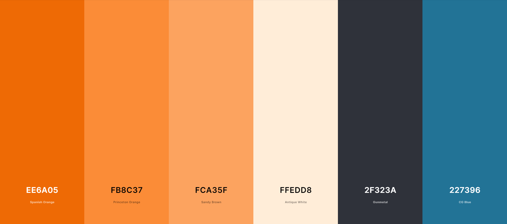

# Unforgettable
Unforgettable is intended to be a small yet enjoyable and addictive browser-based game that tests the user's memory with rapid intensity. The game should be easy to pick up for new users and quick and simple to play for both new and returning users. The site should be intuitive to navigate, pleasing on the eye, and not distract from the main game loop.

## Contents
- [UX](#ux)  
- [Design](#design)  
- [Features](#features)  
- [Technologies Used](#technologies-used)  
- [Deployment](#deployment)  
- [Testing](#testing)  
- [Credits](#credits)  

## UX
### User Stories:  
- The main goal of this website for new users is to quickly convey what the game is and how to play it. New users should instinctively know what each section of the page does and how to interact with the site. The first area of focus should be the instructions which should effectively educate the user on the basics of the game. Importantly, the website should seem easy to interact with to encourage the user to continue using it. The target audience of this website is anyone interested in quick brain training in a small and simple package.
- The requirements for returning users are largely equivalent. The main focus for repeat visitors of the site is that the instructions do not serve as an annoying obstacle to be maneuvered upon each load of the site. The experience should remain consistent for a returning user every time they revisit the site.

## Design
### Colour Scheme:

Above is the colour scheme for the unforgettable website, courtesy of [Coolors](https://coolors.co/).  

For this site, I wanted the colour scheme to stand back and let the main game sell the website. For this reason I chose to use only 3 main colours (Spanish Orange, Gunmetal, and CG Blue) and relied on shades of these to create a slightly more dynamic feel. I wanted the main shades to be orange because I find it to be an easier colour on the eye when viewed on a digital display and it also allowed for strong contrast with the blue used on the site. Additionally, I used a slightly orange-tinted white and a charcoal-ish grey instead of a stark white and black to continue the muted atmosphere.

### Typography:

## Features

### Future Implementations:

## Technologies Used

- This website was created with the HTML5, CSS3, and JavaScript programming languages.  
- This website was developed within [Gitpod](https://www.gitpod.io/).  
- The repository for this website was created using [GitHub](https://github.com/) and [Git](https://git-scm.com/) was used for version control.  
- The fonts used on this website were imported from [Google Fonts](https://fonts.google.com/about).  
- The image used in the introduction of this README was taken from [Am I Responsive?](https://ui.dev/amiresponsive).  
- The favicon used for this site was generated from [favicon.io](https://favicon.io/).

## Deployment

This website was developed using Gitpod and pushed to GitHub. It was then deployed from it's GitHub repository to GitHub Pages using the following steps:  
1. Select **Settings** from the hotbar at the top of the repository's main page.
2. Select **Pages** from the _Code and Automation_ section on the left of the screen.
3. Under _Branch_ select the drop-down menu labelled _None_ and select **main**.
4. Click **Save**.
5. The site will be deployed after a short moment.  

Changes that are committed and pushed to GitHub will automatically be updated on GitHub Pages.

To clone this repository paste `git clone https://github.com/Shabucky1812/unforgettable.git` into the terminal of the editor you are using.  

## Testing  

## Credits
### Contents  
  
### Media  

### Acknowledgements  
