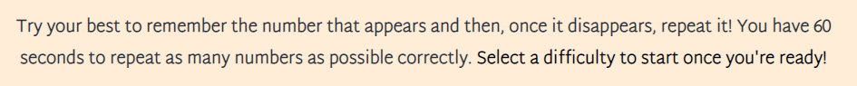
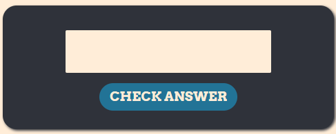

# Unforgettable
Unforgettable is intended to be a small yet enjoyable and addictive browser-based game that tests the user's memory with rapid intensity. The game should be easy to pick up for new users and quick and simple to play for both new and returning users. The site should be intuitive to navigate, pleasing on the eye, and not distract from the main game loop.

## Contents
- [UX](#ux)  
- [Design](#design)  
- [Features](#features)  
- [Technologies Used](#technologies-used)  
- [Deployment](#deployment)  
- [Testing](#testing)  
- [Credits](#credits)  

## UX
### User Stories:  
- The main goal of this website for new users is to quickly convey what the game is and how to play it. New users should instinctively know what each section of the page does and how to interact with the site. The first area of focus should be the instructions which should effectively educate the user on the basics of the game. Importantly, the website should seem easy to interact with to encourage the user to continue using it. The target audience of this website is anyone interested in quick brain training in a small and simple package.
- The requirements for returning users are largely equivalent. The main focus for repeat visitors of the site is that the instructions do not serve as an annoying obstacle to be maneuvered upon each load of the site. The experience should remain consistent for a returning user every time they revisit the site.

## Design
### Colour Scheme:

Above is the colour scheme for the unforgettable website, courtesy of [Coolors](https://coolors.co/).  

For this site, I wanted the colour scheme to stand back and let the main game sell the website. For this reason I chose to use only 3 main colours (Spanish Orange, Gunmetal, and CG Blue) and relied on shades of these to create a slightly more dynamic feel. I wanted the main shades to be orange because I find it to be an easier colour on the eye when viewed on a digital display and it also allowed for strong contrast with the blue used on the site. Additionally, I used a slightly orange-tinted white and a charcoal-ish grey instead of a stark white and black to continue the muted atmosphere.

### Typography:
  
Above are the fonts used for this website: Arvo and Martel Sans courtesy of [Fontjoy](https://fontjoy.com/) and [Google Fonts](https://fonts.google.com/).

Arvo is the font used for the site headers and buttons. Whilst I wanted the game to be the selling point of the website, the first thing a new user will see upon loading unforgettable is the header so I needed a font which was striking and impactful to encourage the user to remain on the site. It was important to me that the website still possessed character despite its small size and little text content and I believe Arvo is the perfect font to create an impression even when used sparingly.  
Martel Sans is the font used for the instruction text and, more importantly, the output display area. Whereas Arvo is intended to stand out, the role of Martel Sans is to convey important information when it is needed and to blend in when it is not. I didn't want the instruction text to obstruct the user's experience whilst they were playing the game so I wanted to choose a font that was plain and pleasant and nothing more. The biggest consideration in choosing Martel Sans over other simple fonts was how this font handled numbers, as they are the key element of the game and therefore the whole site. The numbers in Martel Sans all sit at the same level and have the same height which is perfect for this website because it just makes the random digits feel more consistent for the user.

## Features
### Header:
  

The header of the website very simply has a strong orange background colour and the main title of the page, coloured gunmetal. It is designed to be eye-catching yet unobtrusive. I used negative letter-spacing values on the title text because I liked the way the individual characters blend neatly together with the Arvo font. The header provides value to the user because it is inviting and creates the general 'mood' of the site.

### Instructions:
  

The instructions text is directly below the header and therefore the next place a new user's eye settles. The text is kept concise to not overwhelm the user and contains all the basic rules of the game. Additionally, the sentence which refers to starting the game is a darker shade compared to the rest of the text to make it more noticeable at a glance and indicate it's importance. This is important for any user who happens to skim the information as it prevents frustration from struggling to run the game. This area of text is designed plainly so that returning users can ignore it and jump straight to the game. The instructions text is valuable to the user because it lets them know how to play the game and doesn't remove from the game experience.

### Difficulty Bar:
  

The difficulty bar contains 3 buttons which all start the game on different difficulties (easy, normal, hard). The buttons change colour from blue to orange when hovered over with a mouse to indicate their clickability to the user. The difficulty bar is valuable to the user as it groups all of the difficulty buttons in one place and allows the user to run the game. The 3 levels of difficulty are important because they increase the range of users who can enjoy the website and allow a sense of progression for those who invest time into getting better at the game.

### Statistics Bar:
  

The statistics bar contains the game timer (featuring an icon from [Font Awesome](https://fontawesome.com/)) and the tallies for correct and incorrect answers. Once a game is started, the timer begins counting down from 60 seconds to 0. It is a valuable feature of the stats bar because it lets the user know how long they have left in their current game and adds a fun level of pressure and excitement to the game. The scores both reset to 0 at the start of a game and increment by 1 per correct or incorrect answer respectively. The scores are valuable to the user because they provide immediate feedback on their ability and allows them to create their own goals/milestones (e.g. 'can I complete normal mode without getting a single answer wrong?'). The scores also add a competitivity to the game which encourages users to tell their friends about the site to try and beat each others scores.  

### Display Area:
  

The display area of the site is where the main interaction with the user occurs. The numbers for the user to memorise are displayed here aswell as various messages in response to user actions ('CORRECT', 'WRONG', 'FINISH'). As the user will be spending most of their game time looking at this area, I used a very muted orange tone for the background and a solid blue for the text to create high contrast and good readability. The font size is very large and the characters are spaced wide so that they stand out individually, these features are important because they aid the user in remembering the numbers that flash on display quickly. The display box itself also has a slight shadow effect and 2 curved edges to provide a little visual interest, not enough to distract but just enough to embelish the site in a positive way. The display area is valuable to the user as it is the main source of interaction and responsible for the smooth running of the game loop.

### Input Area:
  

The input area of the website is where the user enters and submits their guesses during a game. It contains a number input box and a submit button. The submit button is styled identically to the difficulty buttons for consistency and possesses the same hover-colouring to tell the user that it is also clickable. The input box automatically clears itself after every submit so the user only has to focus on the numbers and not an annoying UI. The user can submit their answer with the submit button or by just pressing the enter key on a keyboard. There is also a timer that prevents the user from accidentally/purposefully submitting multiple times in a row which would otherwise affect their score or cause errors within the game. This area is valuable to the user as it is where the user plays the game.

### Footer:
  

The footer of the site contains a small prompt to interact with an external unforgettable community and some links to common social media platforms. The links take the form of [Font Awesome](https://fontawesome.com/) icons and all open in a new tab as is standard. The styling of the footer is mostly equivalent to that of the header with the exception of the font used because it is not important for the footer to stand out in the same way. I wanted the header and footer to look similar because the symmetrical feel naturally draws the user's eye to the centre of the page, where the main game takes place. The footer is valuable to the user because it encourages the user to interact with other users of the site and colour-blocks the page to create a more pleasant UX. 

### Future Implementations:
- A feature I would like to add to this project in the future would be an arcade-style leaderboard for each difficulty. Something that would display the top 10 global scores and maybe even toggle to show only the top 10 daily/weekly/monthly scores. If a user achieved a score that fit onto a top 10 list then they would be prompted to enter either a name or just 3 initials similar to arcade machine leaderboards. Currently, the site is very effective for users on an individual scale but it lacks any in-built interaction with other users. A global leaderboard would be a really nice way to alleviate this issue. The reason this feature is not within this version of unforgettable is that it was simply outside of the scope of this project for now. I do fully intend to return to this project at a later date with more experience to implement this feature.

## Technologies Used

- This website was created with the HTML5, CSS3, and JavaScript programming languages.  
- This website was developed within [Gitpod](https://www.gitpod.io/).  
- The repository for this website was created using [GitHub](https://github.com/) and [Git](https://git-scm.com/) was used for version control.  
- The fonts used on this website were imported from [Google Fonts](https://fonts.google.com/about).  
- The image used in the introduction of this README was taken from [Am I Responsive?](https://ui.dev/amiresponsive).  
- The favicon used for this site was generated from [favicon.io](https://favicon.io/).

## Deployment

This website was developed using Gitpod and pushed to GitHub. It was then deployed from it's GitHub repository to GitHub Pages using the following steps:  
1. Select **Settings** from the hotbar at the top of the repository's main page.
2. Select **Pages** from the _Code and Automation_ section on the left of the screen.
3. Under _Branch_ select the drop-down menu labelled _None_ and select **main**.
4. Click **Save**.
5. The site will be deployed after a short moment.  

Changes that are committed and pushed to GitHub will automatically be updated on GitHub Pages.

To clone this repository paste `git clone https://github.com/Shabucky1812/unforgettable.git` into the terminal of the editor you are using.  

## Testing  

## Credits
### Contents  
  
### Media  

### Acknowledgements  
